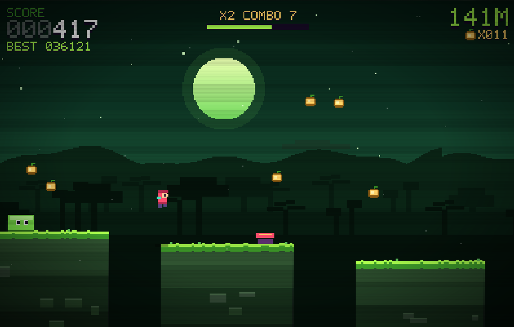
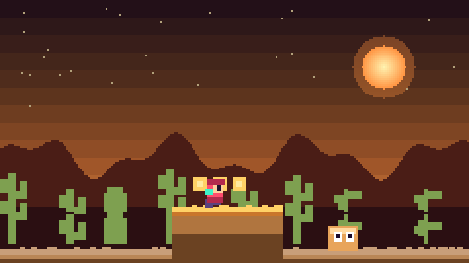
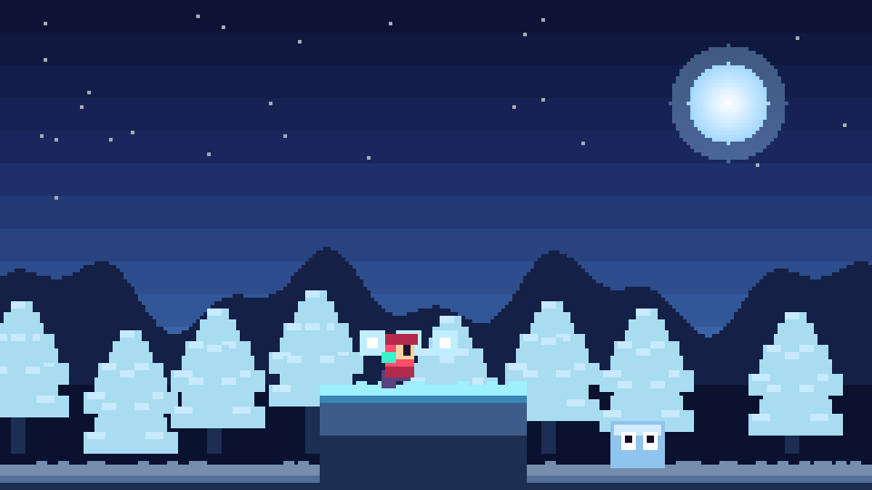
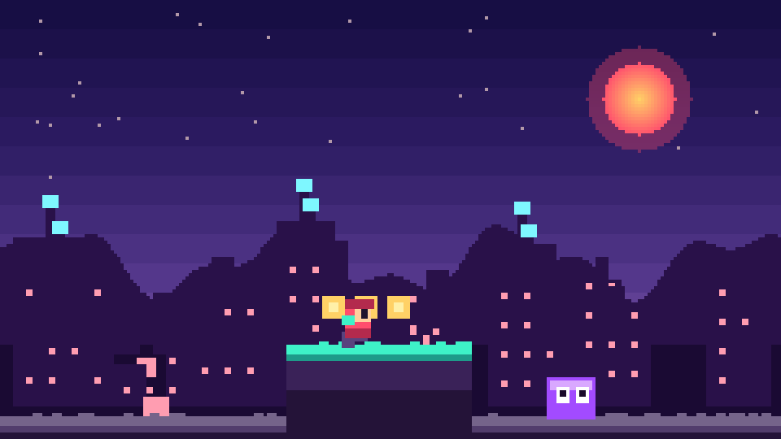

# PIXEL RUN

PIXEL RUN is a browser-based endless runner and 2D platform game built with TypeScript, React, Vite and HTML5 Canvas.

- Play in your browser: https://jimm144.github.io/pixel-run/
- Play on itch.io: https://jimm144.itch.io/pixel-run

## Screenshots






## Gameplay

The player runs automatically. Jump, double jump and dive through four biomes: jungle, desert, tundra and neon city.

- Stomp enemies from above to defeat them
- Dive-slam to break rooted hazards
- Collect coins and gems for score
- Grab power-ups: shield, jump shoes, triple jump, propeller
- The combo meter builds with every score event (enemy stomps, coins, gems, power-ups) and multiplies the points from each while it lasts

The best run and the last run are stored locally (localStorage).

## Daily Quests

Four quests are generated for each local calendar day. Quests can track one run or the combined totals for the day.

- Easy: 40%, green
- Medium: 34%, orange
- Hard: 20%, red
- Special: 5%, purple
- Impossible: 1%, black

Quest objectives include collecting coins or power-ups, running meters, scoring points, defeating enemies, jumping, reaching a x10 combo, completing a run without pickups or kills, triggering every biome effect in one run, and having two power-ups active at once.

Quest progress, completed quests, and completed quest totals by difficulty are stored locally. Daily definitions reset with the local date.

## Controls

Keyboard:

- SPACE, W, UP, Z or K: jump
- Jump key twice: double jump
- Hold jump: higher jump
- S, DOWN or J: dive
- D or RIGHT: boost
- P or ESC: pause

Touch:

- Tap: jump
- Double tap: double jump
- Hold: higher jump
- DIVE button: dive
- Pause button: pause

## Biomes

Four zones repeat in a shuffled order each run. Each zone has its own palette, parallax background, enemies, coins and music. Zone transitions fade gradually.

## Technical

- TypeScript, React, Vite
- Single HTML5 canvas renderer, pixel art, no image assets
- Music and sound effects generated at runtime with the Web Audio API
- Production build is one self-contained HTML file (vite-plugin-singlefile)
- Font: Press Start 2P from Google Fonts

## Development

Requires Node.js.

```
npm install
npm run dev
```

Production build:

```
npm run build
```

Output: `dist/index.html`. Pushing to master deploys it to GitHub Pages via the workflow in `.github/workflows/deploy.yml`.

## License

GPL-3.0. See [`LICENSE`](LICENSE).
